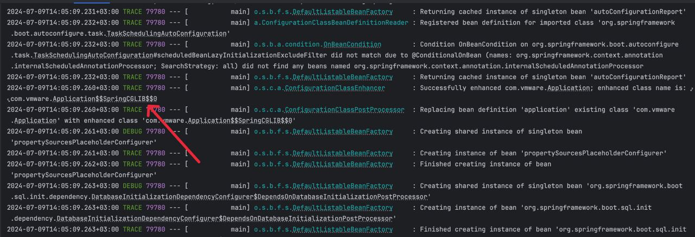

# Spring Boot 3.0 by default use CGLib proxy
Thank you Iuliana [@iuliana](https://github.com/iuliana) Cosmina for `Spring Pro 6`: it is one of the best books for preparation for VMWare Spring Professional Certification.
I think that the best way to prepare for certification read that book and some practical experience.

During reading the book was found minor issue: starting from Spring 5, Spring AOP by default uses CGLib proxy. Hope my investigation will help to improve the book.

Steps to reproduce:
1. Add `spring-boot-starter-<something>` to `build.gradle.kts`: it will add transitive dependency `spring-boot-autoconfigure`
2. At `spring-boot-autoconfigure` we can see `spring.factories`: there is configuration `TransactionAutoConfiguration` that will be started after context start up
3. `TransactionAutoConfiguration` works only if at classpath exists in `PlatformTransactionManager`
4. Most important part of `TransactionAutoConfiguration` is `EnableTransactionManagementConfiguration`:
5. By default for all modern Spring Boot applications used `spring.aop.proxy-target-class=true`. It means that Spring AOP will use CGLib proxy by default
6. Simply run `./tools/scripts/run.sh` to make sure :)

